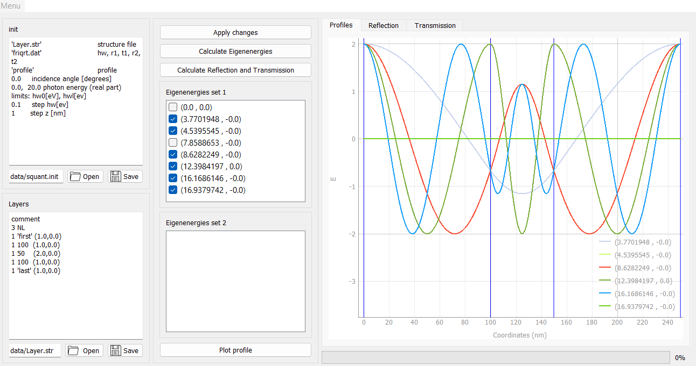

# S-Quantization Photonic Modes Calculation

This program, originally developed in 2017, calculates photonic eigenmodes using the S-quantization method. The detailed method is described in the paper:
> Kaliteevski, M.A., Mazlin, V.A., Ivanov, K.A. et al. Quantization of electromagnetic field in an inhomogeneous medium based on scattering matrix formalism (S-quantization). Opt. Spectrosc. 119, 832–837 (2015). [https://doi.org/10.1134/S0030400X15110120](https://doi.org/10.1134/S0030400X15110120)

## Program Description

The program calculates the photonic eigenmodes in a specified multilayer structure. It requires two input files:
- `*.init` file specifying initialization parameters.
- `*.str` file describing the structure of the layers.

### GUI Features

- **Apply Changes**: Apply modifications made in configuration files.
- **Calculate Eigenenergies**: Computes the eigenmodes in electron volts (eV). These can be visualized using the **Plot Profile** button.
- **Calculate Reflection and Transmission**: Computes the reflection and transmission coefficients for the specified structure.

### Requirements

Ensure you have the following Python packages installed:
- `numpy`
- `mpmath`
- `pyqtgraph`
- `PyQt5`
  
You can install the necessary packages using the following command:
```bash
pip install -r requirements.txt
```

### Run the program:
```bash
python main.py
```

### Screenshot

Below is a screenshot of the application:


